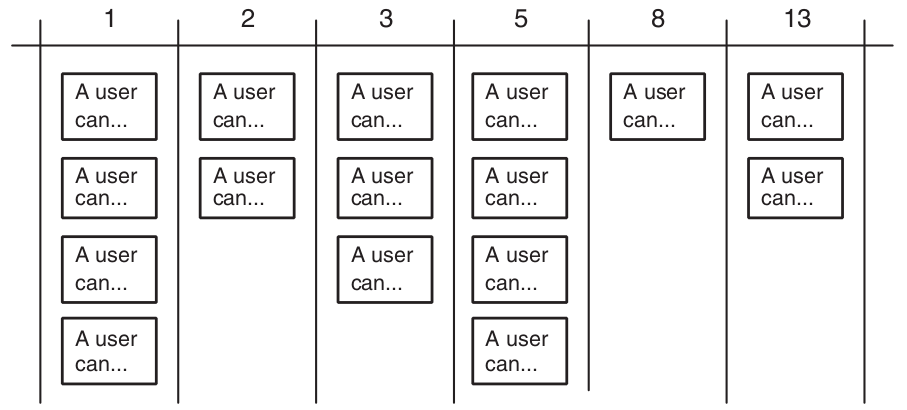

# User Stories
 
## They do come true!

# Overview

&nbsp;

## What are User Stories?

* Short description of valued functionality.
* Discussion.

## Written by the Product Team

* User Stories must be written in the language of the business, not technical jargon.
* As the primary product visionaries, Product is in the best position teo describe the behavior of the product.

# User Stories

## Independent, Negotiable, Valuable, Estimatable, Small, Testable

## Independent

User Stories must be as independent as possible.

## Tasks that depend on each other:

* Customers can pay with Visa (3 days)
* Customers can pay with MasterCard (0.5 days)
* Customers can pay with Visa Electron (0.5 days)

## Breaking the dependency

* A customer can pay with one type of credit/debit card (3 days)
* A customer can pay with two additional types of credit cards (1 day)

Note: Accept Visa, Visa Electron and MasterCard.

## When that's not possible

* Customers can pay with Visa (3 | 0.5 days)
* Customers can pay with MasterCard (3 | 0.5 days)
* Customers can pay with Visa Electron (3 | 0.5 days)

## Negotiable

User Stories should be discussed between Product and Engineering/Operations/Architecture.

## Valuable to users or the company

Valuable to users:

* All errors are presented to the user and logged consistently.

Not valuable to users:

* All error handling is done through the Logger class.

## Estimatable

Engineering must be able to estimate the user stories.

Possible problems:

* Engineering lacks domain knowledge -> Discuss with Produt
* Engineering lacks technical kowledge -> Learn/experiment/build prototype
* The Story is too big -> Product must separate it in smaller stories.

## Small

### Compound stories

* Merchants can sell products in points of sale.

Split in:

* Merchants can create and edit points of sale.
* Merchant can assign products to points of sale.
* Users accessing a point of sale can buy products assigned to it.

## Small

### Complex stories

* Users can pay with Direct Debit.

Split in:

* Investigate Direct Debit payments.
* Users can pay with Direct Debit.

## How to split

* Workflow steps.
* Business rule variations.
* Major effort (credit card payments).
* Simple/complex: look for simplest version, add complex variations.
* Variations in data.
* Data entry methods (simple vs fancy input).
* Performance.
* Operations (CRUD).
* Break out a spike (investigate, prototype).

## Testable

All User Stories should be testable unless not possible.

## Responsibilities: Engineering

* Help product write stories.
* When asking for a story abouth the use of technology, describe the need in terms of its value to users or the company.

## Responsibilities: Product

* Write user stories that have value, are independent, are testable and appropiately sized.
* Discuss them with Tech.

# Acceptance testing

* Write tests upfront
* Test for bugs, not coverage

## Engineering <-> Product

* What else do the programmers need to know about this story?
* What am I assuming about how this story will be implemented?
* Are there circumstances when this story may behave differently?
* What can go wrong during the story?

## Responsibilities: Engineering

* Automating the execution of acceptance tests.
* Thinking about additional acceptance tests when developing a new story.
* Unit testing the code so that acceptance tests do not need to be specified for every small detail.

## Responsibilities: Product

* Writing the acceptance tests.
 * Software is written to fulfill a vision held by Product.
* Executing the acceptance tests. 

# Guidelines for Good Stories

&nbsp;

## Goal Stories

For each role, identify their goals.

If the stories are too big, split them.

## Closed Stories

* Closed stories finishes with the achievement of a meaningful goal.
* Users feel that they have accomplished something.

## Constraints

Identify constraints (eg support i18n in the future, reports that process 10ks of records)

# Estimating

## Triangulation

## Responsibilities: Engineering

* Defining story points so that they are relevant and usable by the team team.
* Sticking to that definition.
* Giving honest estimates (avoid temptation or pressure).
* Estimating as a team.
* Giving estimates that are consistent with other estimates.

## Responsibilities: Product

* Participating in estimation meetings, but only to answer questions and clarify stories.

# Over to Lars!
